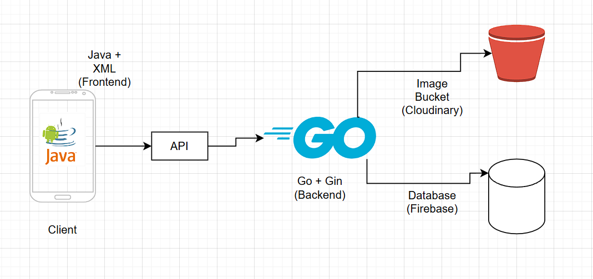

# 🌾 AgriKita - Frontend

AgriKita is a mobile application built for farmers and vendors in rural areas to connect, sell, buy, and manage their agricultural produce and operations. This frontend is developed using **Java** and **XML** for native Android, designed with simplicity, accessibility, and purpose.



---

## 📱 Features

The frontend implements the following core features:

- 🔐 **Authentication**
  - Signup/Login using Firebase Auth
- ☀️ **Weather Forecasting**
  - Real-time weather data to assist farming decisions
- 📦 **Inventory Management**
  - Track products, quantities, and categories
- 💼 **Logistics (Sales Tracker)**
  - Monitor sales, performance, and deliveries
- 🛒 **Product Browsing & Ordering**
  - Buyers can browse and place orders
- 💳 **Payment Integration**
  - Support for secure payment methods

---

## 🔧 Tech Stack

- **Java**
- **XML (Jetpack Compose optional)**
- **Firebase Auth & Firestore**
- **Retrofit (API integration)**
- **Android SDK**

---

## 🛠 Setup & Installation

1. Clone the repository:
   ```bash
   git clone https://github.com/yourusername/agrikita-frontend.git
2. Open in Android Studio

3. Add your google-services.json in the app/ directory

4. Sync Gradle and run the project

